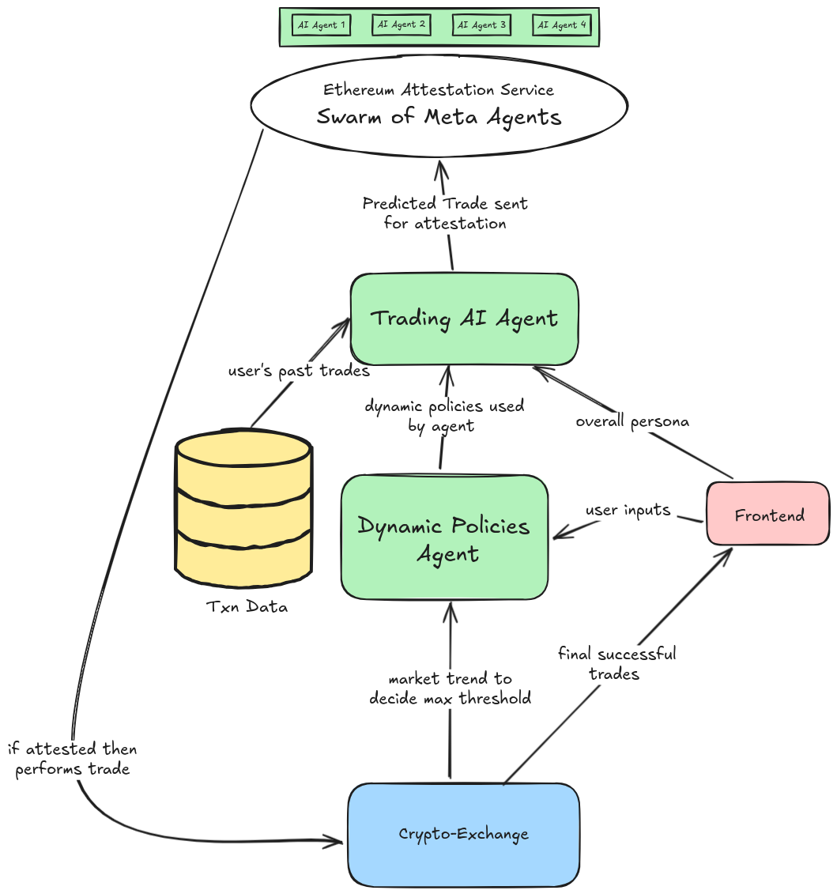

# Personal AI Avatar

**Let your AI twin handle the grind, so you can own your vibe.**

Life's been getting crazier, especially for us Web3 geeks juggling trades, projects, and sleep. Imagine if you had someone who’s *literally* you but handles all that hustle. Meet your **Personal AI Avatar**—an AI that thinks, acts, and trades like you while you kick back and recharge.

### Features

- **Smart Trading**: Missed the last Bitcoin dip because you were snoozing or busy? No worries! Your AI twin is trained on your on-chain vibes, money moves, and risk appetite—basically, it’s your **digital shadow** making moves just like you would. Allocate funds, and your AI twin will trade like a boss, even when you're offline. It’ll ping you for the big stuff or sketchy situations—like a **guardian angel** for your portfolio.

- **Automated Task Management**: This avatar isn’t just about trading. It can handle all the *mind-numbing, repetitive stuff* that eats your day—DAO votes, reviews, emails—anything you’d otherwise have to grind through. Think of it as having a clone for the boring bits, giving you more time to vibe, chill, or crush it in other areas.

- **Enhanced Decision-Making**: Smarter decisions, more free time, and a better shot at work-life balance. Your AI twin is here to save the day and your sanity.

### Challenges We Faced

1. **No Available Options for Testnet DEX Trading**  
   - **Challenge**: We struggled to find reliable testnet DEXs, lacking liquidation pools and essential trading features for effective testing.  
   - **Solution**: We explored various testnets, leveraging simulated environments and community insights to discover experimental DEXs for testing.  

2. **Mitigating Outliers in Human Behavior**  
   - **Challenge**: Outliers in human behavior risked skewing our agent's decisions.  
   - **Solution**: We created a swarm of meta agents to monitor behavior, ensuring that anomalies wouldn’t compromise the model by averaging inputs from multiple agents.  

3. **Lack of Out-of-the-Box Solutions for Multiagent Interaction**  
   - **Challenge**: The new CDP agent kit didn’t offer out-of-the-box solutions for multiagent interactions.  
   - **Solution**: We dug into the libraries’ documentation and collaborated with contributors to develop a custom framework for agent communication.  

4. **Scraping Wallet Transactions for Training**  
   - **Challenge**: Collecting accurate wallet transaction data for model training proved difficult.  
   - **Solution**: We used blockchain APIs and custom scripts to streamline data collection and implemented filters to ensure data quality.  

### Conclusion

Your Personal AI Avatar is you, amplified. With smarter decisions and more free time, you can achieve a better work-life-health balance. Let your AI twin handle the grind and help you take control of your vibe!
